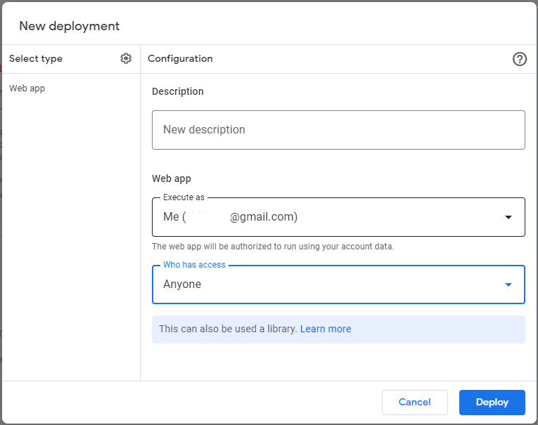
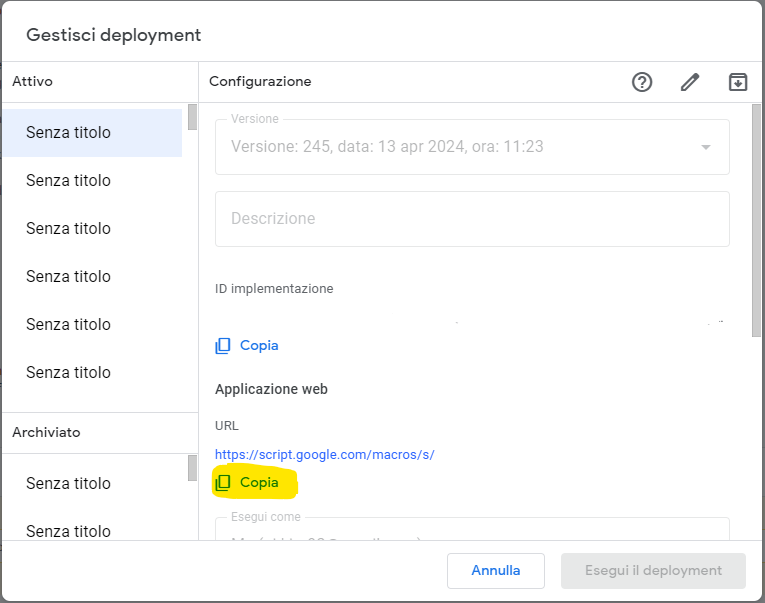

Are you ready to supercharge your Telegram bot development using Google Apps Script? With the Telegram Bot Library, you can create powerful bots that interact seamlessly with users on Telegram. In this guide, I'll walk you through the process of setting up and using the library, including deploying it as a web app for real-time interaction. Let's dive in!

### Prerequisites
Before we begin, ensure you have the following:

1. A Google account.
2. Access to Google Apps Script.
3. A Telegram account.
4. A Telegram bot token. If you don't have one, create a bot on Telegram using the BotFather and obtain your bot token.

### Step 1: Import the Library
To import the Telegram Bot Library into your Google Apps Script project, follow these steps:

1. Open your Google Apps Script project.
2. Go to **Resources** > **Libraries**.
3. Paste the library ID `1e9FPiK1bPI5txvfybe2k9oPurFDWZ3tdHPBpa7-oZmVY2DphwEh0JB0v` into the **"Add a library"** field and click **"Add"**.
4. Select the latest version and click "Save".

### Step 2: Initialize the Bot Handler
Now, let's initialize the bot handler in your script. Here's a breakdown of the Bot Handler class:

- Constructor: Initializes the bot instance with a token, update object, and optional configuration settings.
- Register Handler: Allows registering custom event handlers.
- Process Update: Iterates through registered handlers and executes the appropriate ones based on their conditions.
- Event Handlers: Methods for registering handlers for specific types of events.
- Telegram API Requests: Methods for interacting with the Telegram Bot API.
- Other Utility Methods: Additional utility methods for specific tasks.

### Step 3: Define Bot Commands and Callbacks
You can register handlers for various types of events such as commands, text messages, photos, etc. Here's how you can register a command handler:

```javascript
// Example usage
const TOKEN = 'YOUR_BOT_TOKEN'

const config = {
  webhook: 'YOUR_WEBHOOK_URL'
}

function doPost(e) {
  if (e.postData.type == "application/json") {
    // Parse the update sent from Telegram
    var update = JSON.parse(e.postData.contents);
    // Instantiate our bot passing the update 
    var bot = new Telegram.Bot(TOKEN, update, config);

    bot.onCommand(/\/start/, function () {
      this.replyToSender("It works!");
    });

    // If the update is valid, process it
    if (update) {
      bot.process();
    }
  }
}
```

### Step 4: Deploy as Web App and Set Webhook
Now, deploy your Google Apps Script project as a web app to receive updates from Telegram in real-time. 



Follow these steps:

1. Go to **Publish** > **Deploy as web app**.
2. Choose a version, set access rights, and click "Deploy".
3. Once deployed, run the `setWebhook()` function in your script to set up the webhook for your bot. Make sure to first copy the url to set `bot.config.webhook`. 

```javascript
function setWebhook() {
  var bot = new Telegram.Bot(TOKEN, {}, config);
  var result = bot.request('setWebhook', {
    url: bot.config.webhook
  });
  Logger.log(result);
}
```



### Step 5: Test Your Bot
Now that everything is set up, test your bot by sending commands or messages to it on Telegram. You should see your bot responding according to the defined handlers.

Congratulations! You've successfully integrated the Telegram Bot Library with Google Apps Script. Start building amazing bots and explore the endless possibilities of automation and interaction on Telegram. Happy coding!

## Reference

Here's the reference documentation for the provided Bot Handler:

### Bot Handler

#### Constructor

```javascript
/**
 * Creates a new instance of the Bot Handler
 * @constructor
 * @param {string} token - The token of the Bot
 * @param {json} update - The specific update to process
 * @param {json} config - Optional configuration settings
 */
function Bot(token, update, config) {
  this.token = token;
  this.update = update;
  this.handlers = [];
  this.config = config || {};
}
```

#### Methods

1. **register(handler)**

   Registers a handler object.

   - `handler` (object): The specific custom handler to register.

2. **process()**

   Processes the update by executing the appropriate handlers.

3. **onCommand(regexp, callback)**

   Registers a command handler.

   - `regexp` (regex): The regular expression to match the command.
   - `callback` (function): The callback function to handle the command.

4. **onCallbackData(regexp, callback)**

   Registers a callback data handler.

   - `regexp` (regex): The regular expression to match the callback data.
   - `callback` (function): The callback function to handle the callback data.

5. **on(predicate, callback)**

   Registers a general message handler.

   - `predicate` (function): The condition to match for the message.
   - `callback` (function): The callback function to handle the message.

6. **onText(regexp, callback)**

   Registers a text message handler.

   - `regexp` (regex): The regular expression to match the text message.
   - `callback` (function): The callback function to handle the text message.

7. **onPhoto(callback)**

   Registers a photo message handler.

   - `callback` (function): The callback function to handle the photo message.

8. **onVoice(callback)**

   Registers a voice message handler.

   - `callback` (function): The callback function to handle the voice message.

9. **onVideo(callback)**

   Registers a video message handler.

   - `callback` (function): The callback function to handle the video message.

10. **onDocument(callback)**

    Registers a document message handler.

    - `callback` (function): The callback function to handle the document message.

11. **onLocation(callback)**

    Registers a location message handler.

    - `callback` (function): The callback function to handle the location message.

12. **onSticker(callback)**

    Registers a sticker message handler.

    - `callback` (function): The callback function to handle the sticker message.

13. **onReplyMessage(regexp, callback)**

    Registers a reply message handler.

    - `regexp` (regex): The regular expression to match the reply message.
    - `callback` (function): The callback function to handle the reply message.

14. **onInlineQuery(regexp, callback)**

    Registers an inline query handler.

    - `regexp` (regex): The regular expression to match the inline query.
    - `callback` (function): The callback function to handle the inline query.

15. **request(method, data)**

    Makes a request to the Telegram Bot API.

    - `method` (string): The API method to call.
    - `data` (json): The data to send with the request.

16. **replyToSender(text)**

    Replies to the sender of the current message.

    - `text` (string): The text of the reply message.

17. **replyToMessage(text)**

    Replies to the message that the current message is replying to.

    - `text` (string): The text of the reply message.

18. **reply(chat_id, text)**

    Replies to a specific chat with a text message.

    - `chat_id` (string): The ID of the chat to reply to.
    - `text` (string): The text of the reply message.

19. **sendMessage(where, text)**

    Sends a message to a specific chat.

    - `where` (string): The ID of the chat to send the message to.
    - `text` (string): The text of the message.

20. **sendPhoto(chat_id, photo)**

    Sends a photo to a specific chat.

    - `chat_id` (string): The ID of the chat to send the photo to.
    - `photo` (string): The photo to send (file_id, URL, or file stream).

21. **sendAudio(chat_id, audio)**

    Sends an audio file to a specific chat.

    - `chat_id` (string): The ID of the chat to send the audio to.
    - `audio` (string): The audio file to send (file_id, URL, or file stream).

22. **sendDocument(chat_id, document)**

    Sends a document to a specific chat.

    - `chat_id` (string): The ID of the chat to send the document to.
    - `document` (string): The document to send (file_id, URL, or file stream).

23. **sendVideo(chat_id, video)**

    Sends a video to a specific chat.

    - `chat_id` (string): The ID of the chat to send the video to.
    - `video` (string): The video to send (file_id, URL, or file stream).

24. **sendLocation(chat_id, latitude, longitude)**

    Sends a location to a specific chat.

    - `chat_id` (string): The ID of the chat to send the location to.
    - `latitude` (number): The latitude of the location.
    - `longitude` (number): The longitude of the location.

25. **forwardMessage(chat_id, from_chat_id, message_id)**

    Forwards a message to a specific chat.

    - `chat_id` (string): The ID of the chat to forward the message to.
    - `from_chat_id` (string): The ID of the chat the message is being forwarded from.
    - `message_id` (string): The ID of the message to forward.

26. **deleteMessage(chat_id, message_id)**

    Deletes a message from a specific chat.

    - `chat_id` (string): The ID of the chat to delete the message from.
    - `message_id` (string): The ID of the message to delete.

27. **getFile(file_id)**

    Gets file information for a specific file ID.

    - `file_id` (string): The ID of the file to get information for.

28. **downloadFile(file_id)**

    Downloads a file using its file ID.

    - `file_id` (string): The ID of the file to download.

29. **isAdministrator(user_id, chat_id)**

    Checks if a user is an administrator in a specific chat.

    - `user_id` (string): The ID of the user to check.
    - `chat_id` (string): The ID of the chat to check.

### Note

This documentation assumes familiarity with the Telegram Bot API and its methods. Ensure that you have proper authentication and permissions set up to use these methods effectively.